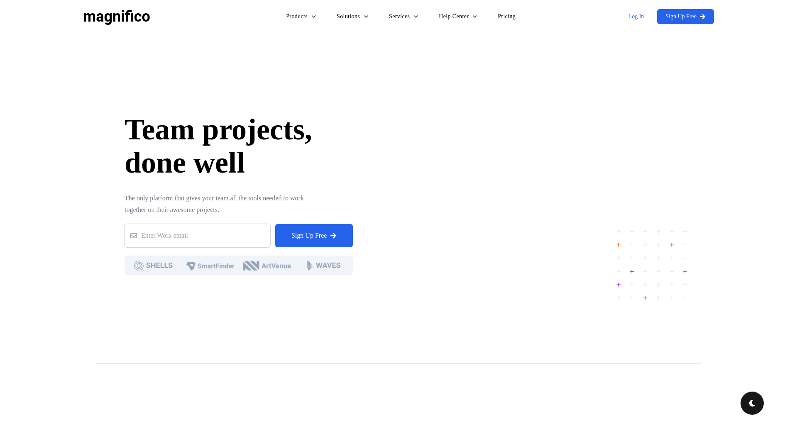

    updated on: 28th May 2025, Wednesday

<div align=center>
    <a href="https://github.com/warmachine028/magnifico">
        
    </a>
    <p style="font-family: roboto, calibri; font-size:12pt; font-style:italic"> A sleek and responsive website </p>
    <a src="https://github.com/warmachine028/magnifico/forks">
        
    </a>
</div>

# [Magnifico](https://github.com/warmachine028/magnifico)

![line]

## Table of Contents

- [Introduction](#introduction) 
- [Development](#development)
- [Tech Stack Used](#tech-stack-used)
- [Design](#design)
- [Preview](#preview)
- [Best Contributors](#best-contributors)
- [License](#license)

![line]

## Introduction

- A modern design and responsive website.
- Frontend project based upon React JS and Tailwind CSS

![line]

## Development

```sh
$> cd client
$> npm i       # install all packages
$> npm run dev # run the frontend
```

![line]

## Tech Stack Used

- React js
- Tailwind 
- Java Script
- Vite
- Github

     

![line]

## Design

- [Figma file for Spyder 2024](https://www.figma.com/design/6lYnnVnpynejdPoqdS6dxt/SPYDER-2024?node-id=0-1&node-type=canvas&t=s1Q7nwepfp2ZU2X9-0)

![line]


## Preview

<picture align="center">
    <source media="(prefers-color-scheme: light)" srcset=".github/preview-light.png">
    <source media="(prefers-color-scheme: dark)" srcset=".github/preview-dark.png">
    
</picture>

![line]

## Best Contributors

<div align="center">
    <a href="https://github.com/warmachine028/magnifico/graphs/contributors">
        
    </a>
</div>

![line]

## License

- See [LICENSE]

**Pritam Kundu, 2024**

![line]

## Thank you, everyone 💚

[icons]: https://icons8.com/
[markdown-badges]: https://github.com/Ileriayo/markdown-badges
[line]: https://user-images.githubusercontent.com/75939390/137615281-3a875960-92cc-407f-97fe-fd2319bdb252.png
[License]: https://github.com/warmachine028/magnifico/blob/main/LICENSE

<!-- 28/05/25 -->
